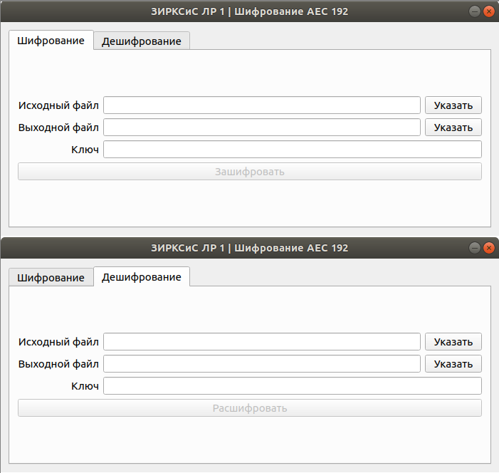

ЗИРКСиС Лабораторная работа №1 - QT GUI
==================

#### Содержимое
Название файла  |  Описание
----------------|---------------------
main.cpp        | Точка входа
aesalgorithm.h  | Интерфейс класса AESAlgorithm
aesalgorithm.cpp| Реализация класса AESAlgorithm
mainwindow.h    | Интерфейс класса главного окна MainWindow
mainwindow.cpp  | Реализация класса  главного окна MainWindow
mainwindow.ui   | Форма окна с компонентами
ZIRKSIS_LR_1_GUI.pro | Параметры сборки проекта QT

#### Зависимости - openssl
### Внешний вид

